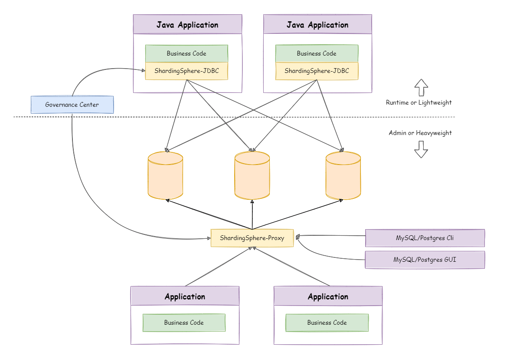

# 背景
shardingsphere-jdbc + dynamic + seata + zookeeper实现本地事务与分布式事务自动切换。
- 思考：分表业务场景下，数据库大部分是不需要分表，如何实现共存。
  - 方案一：shardingsphere支持配置单表。缺点：线上业务复杂维护表时需配置单表，且所有表经过SS 5.4.0代理后存在内存泄露问题。
  - 方案二：整合dynamic动态数据源，把分表放入另一个数据源中。
- 官方说明

# 原理分析
- 事务提交流程
  - 跨数据源事务互相隔离，因为不同的数据源创建的Connection不同，无法传播。
  - 分布式事务@GlobalTransaction注解使用场景
    - 跨数据源需在同一事务
    - 跨服务需在同一事务
  - 
- 组件架构图
  - 
- 动态数据源结构
  - 
- 核心源码说明
  - 使用zk内配置的分表规则创建分表本地数据源、SEATA数据源
  - 
  - 把分表数据源交给mybatis动态数据源管理
  - 
  - 事务管理切面动态切换本地事务、SEATA事务
  - 
# 使用说明
- 1.按官方文档部署seata、zookeeper
- 2.配置文件
~~~
seata:
# 动态数据源启用seata管理事务关闭seata自动代理datasource
  enable-auto-data-source-proxy: false
# 接入mybatis动态数据源
spring:
  zookeeper:
    server: ip:port
    namespace: distributed_db
  datasource:
    dynamic:
      enabled: true
      # 启用 seata管理多数据源事务，无分布式事务不配置
      seata: true
      # 默认数据源名称
      primary: xxx
      strict: false #严格匹配数据源,默认false. true未匹配到指定数据源时抛异常,false使用默认数据源
      sharding:
        # 分表数据源逻辑库名称，与mybatis动态数据源名称一致
        datasource: logic_xxx
~~~
- 3.代码使用
~~~
@Sharding(ds = "logic_game_goods", tx = true)
public void updateByGoodsNo(String title) {
    GoodsEntity goodsEntity = findByGoodsNo("RHF11");
    goodsEntity.setTitle(title);
    goodsMapper.update(goodsEntity, new LambdaUpdateWrapper<GoodsEntity>().eq(GoodsEntity::getGoodsNo, goodsEntity.getGoodsNo()));
    throw new RuntimeException("TTTT");
}
~~~
